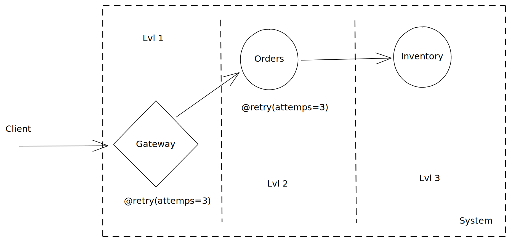

# Retries

## Introduction

Distributed systems are full of temporary issues - network failures, sudden latency increases, 
bandwidth exhaustion, node evictions and partial pods rescheduling, temporary overloading of some microservices, etc. 
All of that can create situations when your requests may be delayed, queued or failed. 

What can you do in that case? The most natural answer is to **retry your request**. 
Hence, retry is the most fundamental, intuitive and commonly used component in our resilience toolkit.

However, retries might look deceptively simple and straightforward, 
The real usage of retries is more nuanced as you will read throughout this page.

## Use cases

- Retries hide temporary short-lived errors
- Jitters are useful to reduce congestion on resources

## Usage

Hyx provides a decorator that brings retry functionality to any function:

```Python hl_lines="5 8"
{!> ./snippets/retry/retry_basic_usage.py !}
```

::: hyx.retry.retry
    :docstring:

## Backoffs

The backoff strategy is a crucial parameter to consider. 
Depending on the backoff, the retry component can help your system or be a source of problems.

!!! warning
    For the sake of simplicity, Hyx assumes that you are following AsyncIO best practices and not running CPU-intensive operations in the main thread.
    Otherwise, the backoff delays may fire later after the thread is unblocked.

### Constant Backoff

The most basic backoff strategy is to wait the constant amount of time on each retry.

```Python hl_lines="8"
{!> ./snippets/retry/retry_backoff_const.py !}
```

The `float` backoffs are just aliases for the `const` backoff.

::: hyx.retry.backoffs.const
    :docstring:

### Interval Backoff

You can also provide a list or a tuple of floats to pull delays from it in a sequential and <abbr title="starts taking delays from the beginning of the list if attempts are more than delays in the list">cyclical</abbr> manner.

```Python hl_lines="8"
{!> ./snippets/retry/retry_backoff_const_intervals.py !}
```

The `list[float]` and `tuple[float, ...]` backoffs are just aliases for the `interval` backoff.

::: hyx.retry.backoffs.interval
    :docstring:

### Exponential Backoff

Exponential backoff is one of the most popular backoff strategies. 
It produces delays that growth rapidly. That gives the faulty functionality more and more time to recover on each retry.

Hyx implements the Capped Exponential Backoff that allows to specify the `max_delay_secs` bound:

```Python hl_lines="9"
{!> ./snippets/retry/retry_backoff_expo.py !}
```

::: hyx.retry.backoffs.expo
    :docstring:

### Linear Backoff

Linear Backoff growth linearly by adding `additive_secs` on each retry:

```Python hl_lines="9"
{!> ./snippets/retry/retry_backoff_linear.py !}
```

::: hyx.retry.backoffs.linear
    :docstring:

### Fibonacci Backoff

Another rapidly growing backoff is based on the Fibonacci sequence:

```Python hl_lines="9"
{!> ./snippets/retry/retry_backoff_fibo.py !}
```

::: hyx.retry.backoffs.fibo
    :docstring:

### Decorrelated Exponential Backoff

This is a complex backoff strategy proposed by [AWS Research](https://aws.amazon.com/blogs/architecture/exponential-backoff-and-jitter/).
It's based on [the exponential backoff](#exponential-backoff) and includes [the full jitter](#full-jitter). 
On every retry, it exponentially widens the range of possible delays.

```Python hl_lines="9"
{!> ./snippets/retry/retry_backoff_decorrexp.py !}
```

::: hyx.retry.backoffs.decorrexp
    :docstring:

### Soft Exponential Backoff (Beta)

Soft Exponential Backoff is another variation of complex exponential backoffs with built-in [jitter](#jitters). 
It was authored by [the Polly community](https://github.com/App-vNext/Polly/issues/530) as a less spiky alternative to 
[Decorrelated Exponential Backoff](#decorrelated-exponential-backoff).

```Python hl_lines="9"
{!> ./snippets/retry/retry_backoff_softexp.py !}
```

::: hyx.retry.backoffs.softexp
    :docstring:

### Custom Backoffs

In the Hyx design, backoffs are just iterators that returns float numbers and can go on infinitely.

Here is how the factorial backoff could be implemented: 

```Python hl_lines="10-34 37"
{!> ./snippets/retry/retry_backoff_custom.py !}
```

!!! note
    The built-in backoffs accepts delay params in seconds, but works with milliseconds under the hood. 
    That improves granularity of the generated delays.
    Then it returns generated delays in seconds again.

## Jitters

In the high-loaded setups, or when a few requesters that are trying to pull the same API, or just a set of background tasks that do something on schedule,
there may be situations when **they happen to do that action simultaneously**. 
That triggers traffic spikes or unusually high load on the backend system. 
When you use retries in a few clients, they may trigger the load spikes in the same way.

It may push your system to autoscale without many reasons that are not super efficient. 

In that case, we say that the requests were **correlated**. 

In order to mitigate this problem, we can use jitters which is essentially a way to **decorrelated your requests by adding some randomness**.
That helps to distribute load more evenly and process the same amount of requests with less capacity.

In the Hyx design, jitters are part of backoff strategy.

!!! note
    [Constant](#constant-backoff), [exponential](#exponential-backoff), [linear](#linear-backoff) and [fibonacci](#fibonacci-backoff) backoffs supports
    jitters listed below as an optional argument.

### Full Jitter

Full Jitter is a decorrelation strategy proposed by [AWS Research](https://aws.amazon.com/blogs/architecture/exponential-backoff-and-jitter/).

It takes a delay from the range between zero and your upper bound uniformly:

```Python hl_lines="9"
{!> ./snippets/retry/retry_backoff_expo_jitter.py !}
```

!!! note
    Full jitter may decide to do the action right away without a delay

::: hyx.retry.jitters.full
    :docstring:

### Equal Jitter

Another jitter algorithm proposed by [AWS Research](https://aws.amazon.com/blogs/architecture/exponential-backoff-and-jitter/).

It takes a middle of the given interval and tries to add some additional delay drawing it from the halved interval at random uniformly.

!!! note
    Equal Jitter guarantees that you will wait at least a half of the given delay interval.

::: hyx.retry.jitters.equal
    :docstring:

### Jittered Backoffs

[Decorrelated Exponential](#decorrelated-exponential-backoff) and [Soft Exponential](#soft-exponential-backoff) backoffs 
provide built-in decorrelation as a part of their algorithm.

### Custom Jitters

Hyx uses jitters as a part of backoff strategies. 
Jitters are callables that take a delay in milliseconds generated by backoff and return the final delay in milliseconds.

!!! note
    Jitters can modify the final delay returned by the backoff algorithm.

```Python hl_lines="11-16 19"
{!> ./snippets/retry/retry_backoff_custom_jitter.py !}
```

## Backoffs Outside Retries

Backoffs and jitters can be useful even outside of retries.

### Worker Pools

In the following example, we create a pool of in-process workers. 
If we had no delays between their scheduling, they would be started almost instantaneously. 
They would complete with each other pulling tasks from the database.

In order to avoid that, we are introducing a little jitter that decorrelates their startup time:

```Python hl_lines="12 24"
{!> ./snippets/retry/jitter_out_retries.py !}
```

Besides that, we are jittering the worker's rest time increasing changes that workers lifecycles end up being different.

## Best Practices

### Limit Retry Attempts

Hyx supports an option to retry infinitely, but that should be generally considered as **an antipattern**.

```Python hl_lines="10"
{!> ./snippets/retry/retry_infinite_attempts.py !}
```

Always prefer to limit the number of retries over the infinite attempts.

### Specify Delays

You can disable delays between retries, but that's **another antipattern** you should not follow:

```Python hl_lines="11"
{!> ./snippets/retry/retry_no_delays.py !}
```

Without delays, retries can easily heat your system and create a situation known as [the retry storm](#retry-storms).

### When and What to Retry

It's important to realize that not every action should be retried. 
When you are dealing with non-idempotent APIs, you can introduce duplicated entries in the system if retried.

When it comes to HTTP requests, you should retry based on the server response errors and consider error codes that
have temporary nature (e.g. 50x errors).

### Avoid Retry Storms

The retry storm is a well-known issue when retries are badly configured or put in the wrong place of the system.

Excessive retries can overload some parts of your system putting it down. 
The two antipatterns above are common ways to misconfigured retries. 
That's why you should always limit the number of retry attempts and give some time between the retries for the downstream system to recover.

The place where retries are added is equally important to avoid retry storms. Consider the following case:

<figure markdown>
  { loading=lazy, align=center }
  <figcaption>A system with retries configured on multiple levels</figcaption>
</figure>

The given system has two retries configured on two levels: `gateway` (lvl1) and `orders` microservice (lvl2). 
If the `inventory` microservice fails, 
it will first exhaust all retries on the `orders` side, and then it will get back to the `gateway`. 
The `gateway` will retry two more times.

The total number of request to the `inventory` microservice will be 3 * 3 which is 9. 
If we had a deeper request chain with more retries on the way, 
all of them would multiply and create even worse load on the system.

The general rule of thumb here is to retry in the component that is directly above the failed one. 
In this case, it would be okay to retry on the `orders` level only.